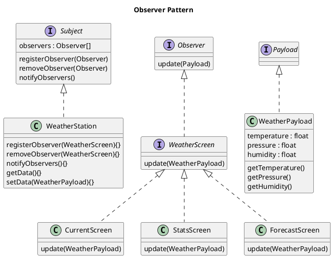

# Observer pattern

The Observer Pattern defines a one-to-many
dependency between objects so that when one
object changes state, all of its dependents are
notified and updated automatically.

```plantuml
@startuml

title Observer Pattern


interface Subject{
  observers : Observer[]
  registerObserver(Observer)
  removeObserver(Observer)
  notifyObservers()
}


interface Observer{
  update(Payload)
}


interface Payload{

}


class WeatherStation{
  registerObserver(WeatherScreen){}
  removeObserver(WeatherScreen){}
  notifyObservers(){}
  getData(){}
  setData(WeatherPayload){}
}


interface WeatherScreen{
  update(WeatherPayload)
}


class CurrentScreen{
  update(WeatherPayload)
}


class StatsScreen{
  update(WeatherPayload)
}


class ForecastScreen{
  update(WeatherPayload)
}


class WeatherPayload{
  temperature : float
  pressure : float
  humidity : float
  getTemperature()
  getPressure()
  getHumidity()
}


Subject <|.. WeatherStation

Observer <|.. WeatherScreen

WeatherScreen <|.. CurrentScreen
WeatherScreen <|.. StatsScreen
WeatherScreen <|.. ForecastScreen

Payload <|.. WeatherPayload


@enduml
```
