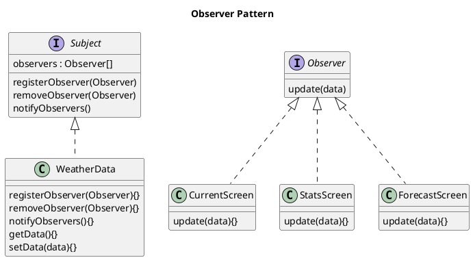

# Observer pattern

The Observer Pattern defines a one-to-many
dependency between objects so that when one
object changes state, all of its dependents are
notified and updated automatically.

```plantuml
@startuml

title Observer Pattern

interface Subject{
  observers : Observer[]
  registerObserver(Observer)
  removeObserver(Observer)
  notifyObservers()
}


interface Observer{
  update(data)
}


class WeatherData{
  registerObserver(Observer){}
  removeObserver(Observer){}
  notifyObservers(){}
  getData(){}
  setData(data){}
}


class CurrentScreen{
  update(data){}
}


class StatsScreen{
  update(data){}
}


class ForecastScreen{
  update(data){}
}


Subject <|.. WeatherData

Observer <|.. CurrentScreen
Observer <|.. StatsScreen
Observer <|.. ForecastScreen

@enduml
```
