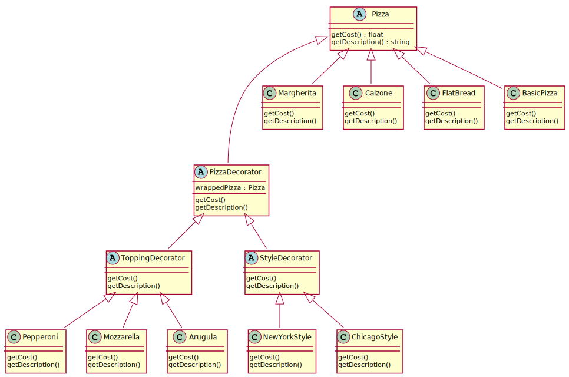
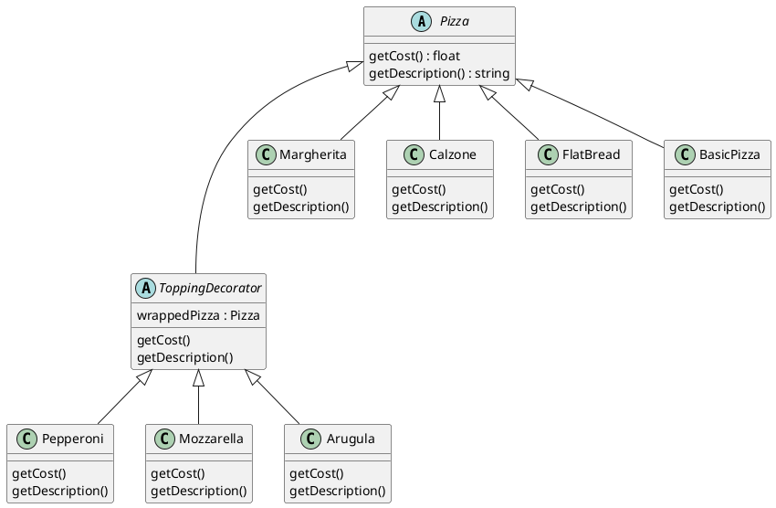

# Decorator Pattern

> The Decorator Pattern attaches additional responsibilities to an object dynamically. Decorators provide a flexible alternative to subclassing for extending functionality.

```plantuml
@startuml

Abstract Pizza{
  getCost() : float
  getDescription() : string
}

Abstract ToppingDecorator{
  getCost()
  getDescription()
  wrappedPizza : Pizza
}

Class Margherita{
  getCost()
  getDescription()
}

Class Calzone{
  getCost()
  getDescription()
}

Class FlatBread{
  getCost()
  getDescription()
}

Class BasicPizza{
  getCost()
  getDescription()
}

Class Pepperoni{
  getCost()
  getDescription()
}

Class Mozzarella{
  getCost()
  getDescription()
}

Class Arugula{
  getCost()
  getDescription()
}

Pizza <|-- Margherita
Pizza <|-- Calzone
Pizza <|-- FlatBread
Pizza <|-- BasicPizza

Pizza <|--- ToppingDecorator

ToppingDecorator <|-- Mozzarella
ToppingDecorator <|-- Pepperoni
ToppingDecorator <|-- Arugula


@enduml
```