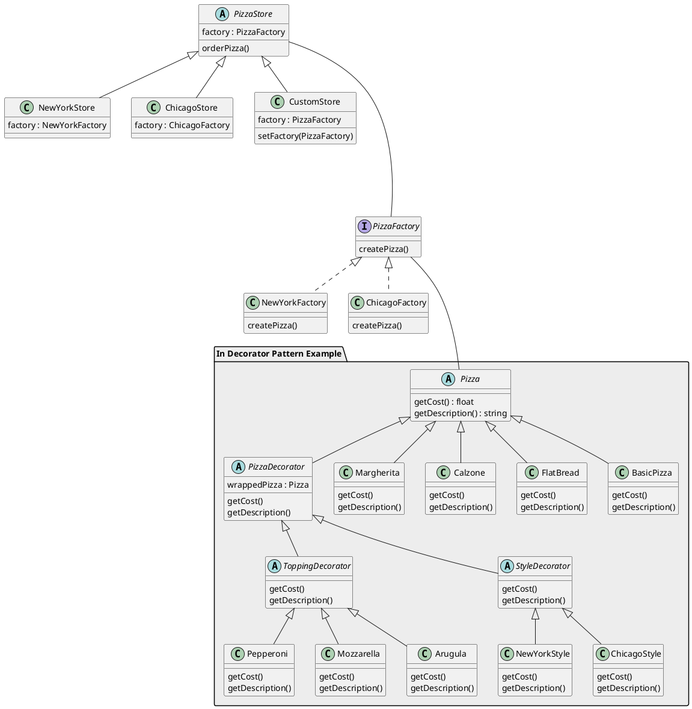

# Factory Pattern

> The Factory Method Pattern defines an interface for creating an object, but lets subclasses decide which class to instantiate. Factory Method lets a class defer instantiation to subclasses.

I didn't like the Factory pattern example from the book, so I made up my own, where the factory produces the selected pizza reusing the base pizza and decorators that I created in the decorator pattern example.

