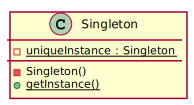

# Singleton Pattern

> The Singleton Pattern ensures a class has only one instance, and provides a global point of access to it.

The Singleton implemented here should be thread safe. The unique instance is lazily initialized.

