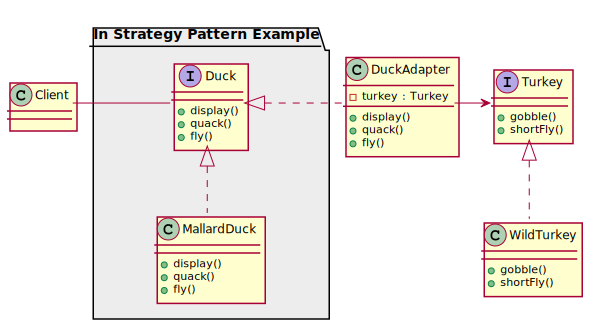

# Adapter Pattern and Facade Pattern

## Adapter Pattern
> The Adapter Pattern converts the interface of a class into another interface the clients expect. Adapter lets classes work together that couldn’t otherwise because of incompatible interfaces.

## Facade Pattern

> The Facade Pattern provides a unified interface to a set of interfaces in a subsytem. Facade defines a higher-level interface that makes the subsystem easier to use.