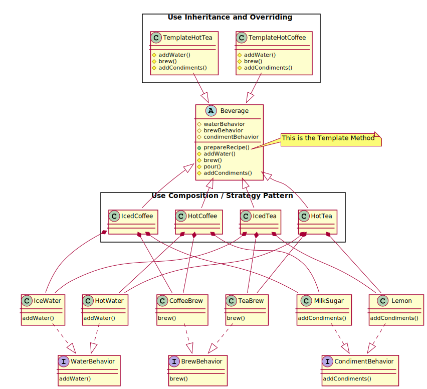

# Template Method Pattern

> The Template Method Pattern defines the skeleton of an algorithm in a method, deferring some steps to subclasses. Template Method lets subclasses redefine certain steps of an algorithm without changing the algorithm’s structure.

Diverging from the book's example, I decided to combine the `Template Method Pattern` and the `Strategy Pattern`. The `Template Method` provides the general workflow, but each of the inner methods are composed using the `Strategy Pattern` instead of concrete methods of the subclasses. This way I can be more flexible, I can reuse code across classes, and I can even change behavior at run time if I feel like it.

The concrete classes have tow ways to change the way the template method is executed: 1) changing the individual behaviors (strategy pattern, more flexible), or 2) overriding the sub-methods altogether (pure Template Method Pattern)

