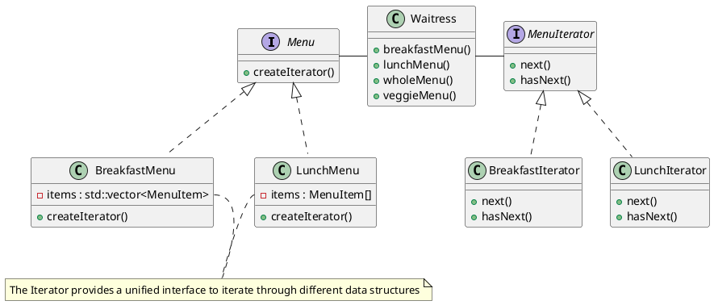

# Iterator Pattern

> The Iterator Pattern provides a way to access the elements of an aggregate object sequentially without exposing its underlying representation.

```plantuml
@startuml


Interface Menu{
  + createIterator()
}

Class BreakfastMenu{
  + createIterator()
  - items : std::vector<MenuItem>
}

Class LunchMenu{
  + createIterator()
  - items : MenuItem[]
}


Interface MenuIterator{
  + next()
  + hasNext()
}

Class BreakfastIterator{
  + next()
  + hasNext()
}

Class LunchIterator{
  + next()
  + hasNext()
}


Class Waitress{
  + breakfastMenu()
  + lunchMenu()
  + wholeMenu()
  + veggieMenu()
}


Menu -right- Waitress
Waitress -right- MenuIterator


Menu <|..  BreakfastMenu 
Menu <|..  LunchMenu

MenuIterator <|..  BreakfastIterator 
MenuIterator <|..  LunchIterator


note "The Iterator provides a unified interface to iterate through different data structures" as N0
BreakfastMenu::items .. N0
LunchMenu::items .. N0


@enduml
```
