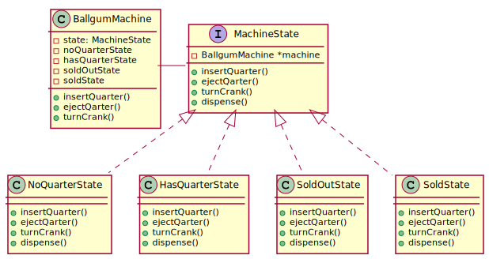
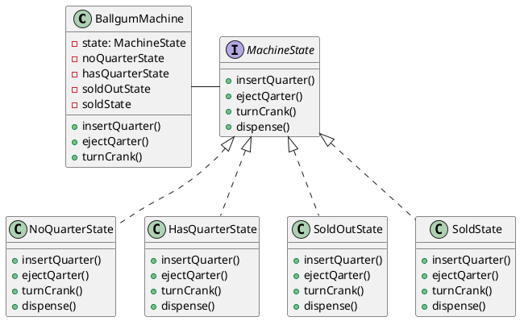

# Iterator Pattern

> The State Pattern allows an object to alter its behavior when its internal state changes. The object will appear to change its class.

```plantuml
@startuml

Class BallgumMachine{
  + insertQuarter()
  + ejectQarter()
  + turnCrank()
  - state: MachineState
  - noQuarterState
  - hasQuarterState
  - soldOutState
  - soldState
}

Interface MachineState{
  + insertQuarter()
  + ejectQarter()
  + turnCrank()
  + dispense()
}

Class NoQuarterState{
  + insertQuarter()
  + ejectQarter()
  + turnCrank()
  + dispense()
}

Class HasQuarterState{
  + insertQuarter()
  + ejectQarter()
  + turnCrank()
  + dispense()
}

Class SoldOutState{
  + insertQuarter()
  + ejectQarter()
  + turnCrank()
  + dispense()
}

Class SoldState{
  + insertQuarter()
  + ejectQarter()
  + turnCrank()
  + dispense()
}


MachineState <|.. NoQuarterState
MachineState <|.. HasQuarterState
MachineState <|.. SoldOutState
MachineState <|.. SoldState

BallgumMachine - MachineState

@enduml
```
