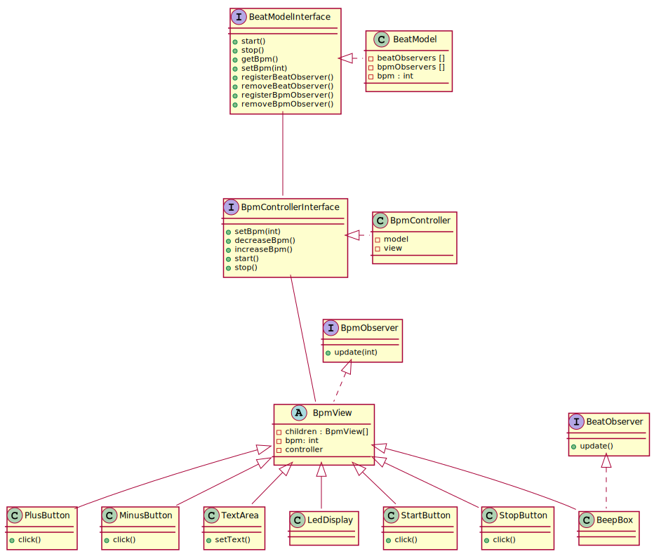
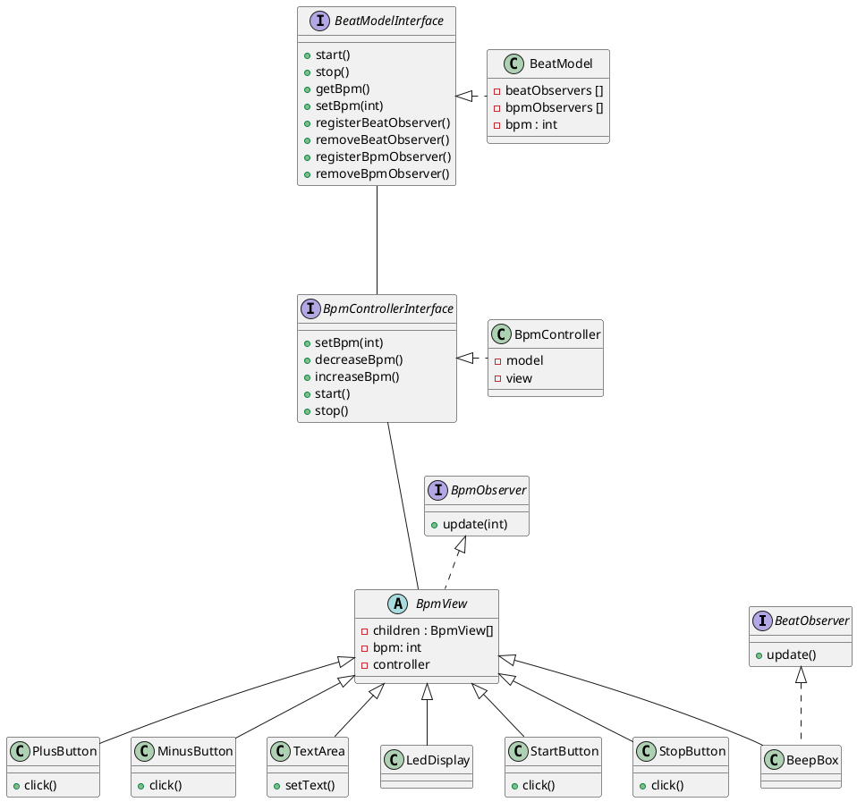

# Model View Controller

> The Model View Controller Pattern (MVC) is a compound pattern consisting of the Observer, Strategy and Composite patterns.

```plantuml
@startuml

Interface BeatObserver{
  + update()
}

Interface BpmObserver{
  + update(int)
}

Interface BeatModelInterface{
  + start()
  + stop()
  + getBpm()
  + setBpm(int)
  + registerBeatObserver()
  + removeBeatObserver()
  + registerBpmObserver()
  + removeBpmObserver()
}

Class BeatModel{
  - beatObservers []
  - bpmObservers []
  - bpm : int

}

Abstract BpmView{
  - children : BpmView[]
  - bpm: int
  - controller
}

Class PlusButton{
  + click()
}

Class MinusButton{
  + click()
}

Class TextArea{
  + setText()
}

Class LedDisplay{

}

Class StartButton{
  + click()
}

Class StopButton{
  + click()
}

Class BeepBox{

}

Interface BpmControllerInterface{
  + setBpm(int)
  + decreaseBpm()
  + increaseBpm()
  + start()
  + stop()
}

Class BpmController{
  - model
  - view
}


BpmObserver <|.. BpmView

BpmView <|-- PlusButton
BpmView <|-- MinusButton
BpmView <|-- TextArea
BpmView <|-- LedDisplay
BpmView <|-- StartButton
BpmView <|-- StopButton
BpmView <|-- BeepBox

BeatObserver <|.. BeepBox


BeatModelInterface <|. BeatModel

BpmControllerInterface <|. BpmController

BpmControllerInterface --- BpmView
BeatModelInterface --- BpmControllerInterface

@enduml
```
