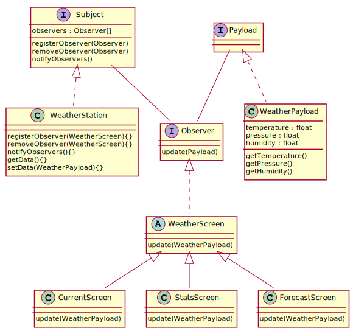

# Design Patterns

A collections of problems and examples I worked out while studying the book [Head First Design Patterns](http://shop.oreilly.com/product/9780596007126) by Eric Freeman and Elizabeth Freeman.

The book uses Java, but I opted to use C++ instead.

1. Strategy pattern
2. Observer pattern
3. Decorator pattern
4. Factory pattern
5. Singleton pattern
6. Command pattern
7. Adapter pattern and Facade pattern
8. Template Method Pattern
9. Iterator Pattern

... More coming as I go

## Strategy Pattern

## Observer Pattern

## Decorator Pattern

## Factory Pattern

## Singleton Pattern

## Command Pattern

## Adapter Pattern

## Template Method Pattern

## Iterator Pattern

